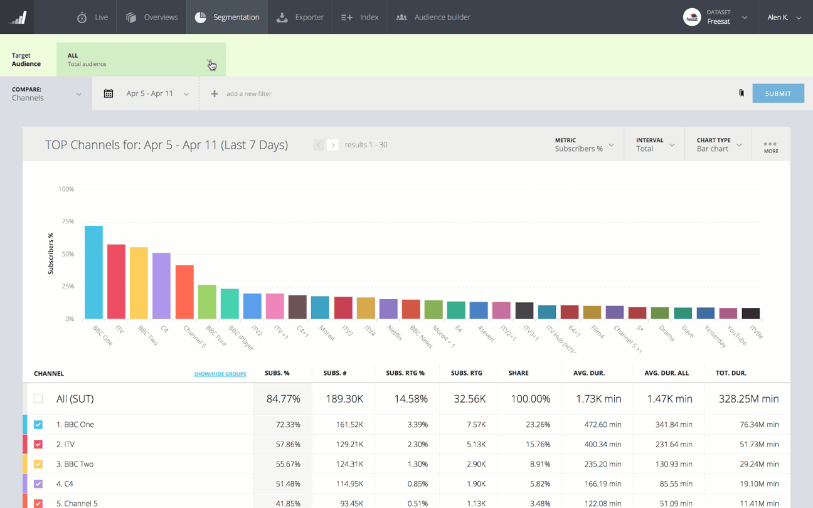
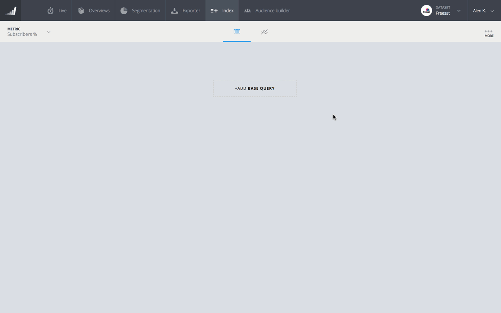

# TVbeat Dashboard Updates

## Audience builder & Indexing update
*10 April, 2018*

### Audience Builder
The **Audience Builder** feature is an upgrade from the existing target audience bar throughout the TVbeat dashboard. The purpose of this upgrade is to enable a cleaner and easier selection of existing as well as a more detailed and expansive creation of audience segments. Now you can build, save, edit custom audience segments and use them throughout the TVbeat dashboard.

The Audience builder view enables you to view all of your created segments. In the Create/Edit part you can now build multilevel conditions with AND/OR operators and really pinpoint your specific audience. We think audience creation is a very important part which help you identify your target audience. The audience segment can also be a list of imported subscribers.

### Indexing
This upgrade includes some visual improvements to the first column view when comparing The base segment against selected Audience segments. We added a metric picker which allows you to compare Index values sorted by all available metrics. 

Additionally we added a Chart view where you can view your comparison in two charts. The first charts provides an index comparison of the selected audience segments. The second chart allows you to select a specific item and compare it on selected audience segments.

